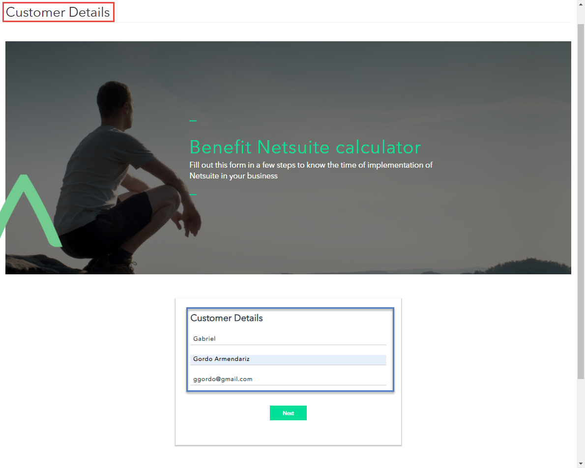
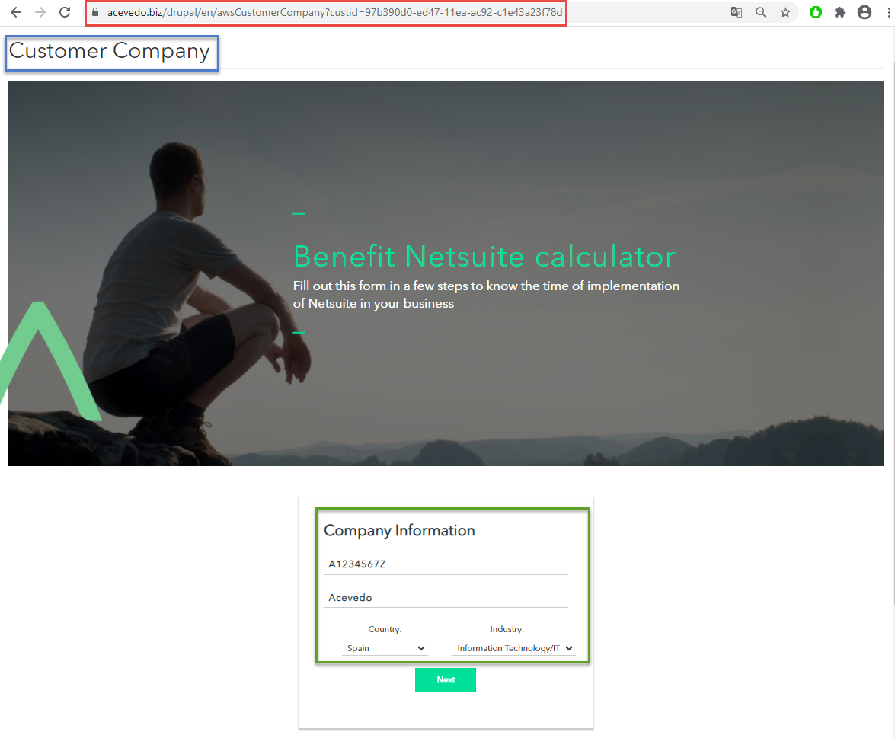
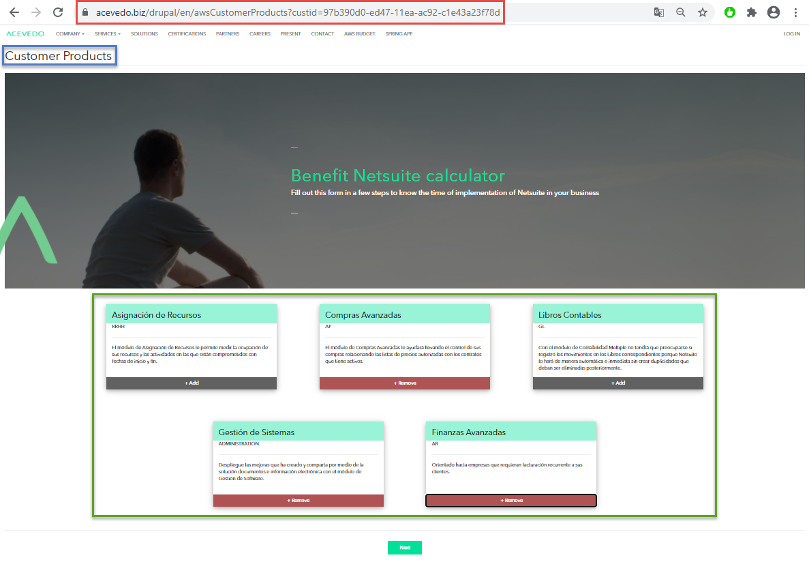
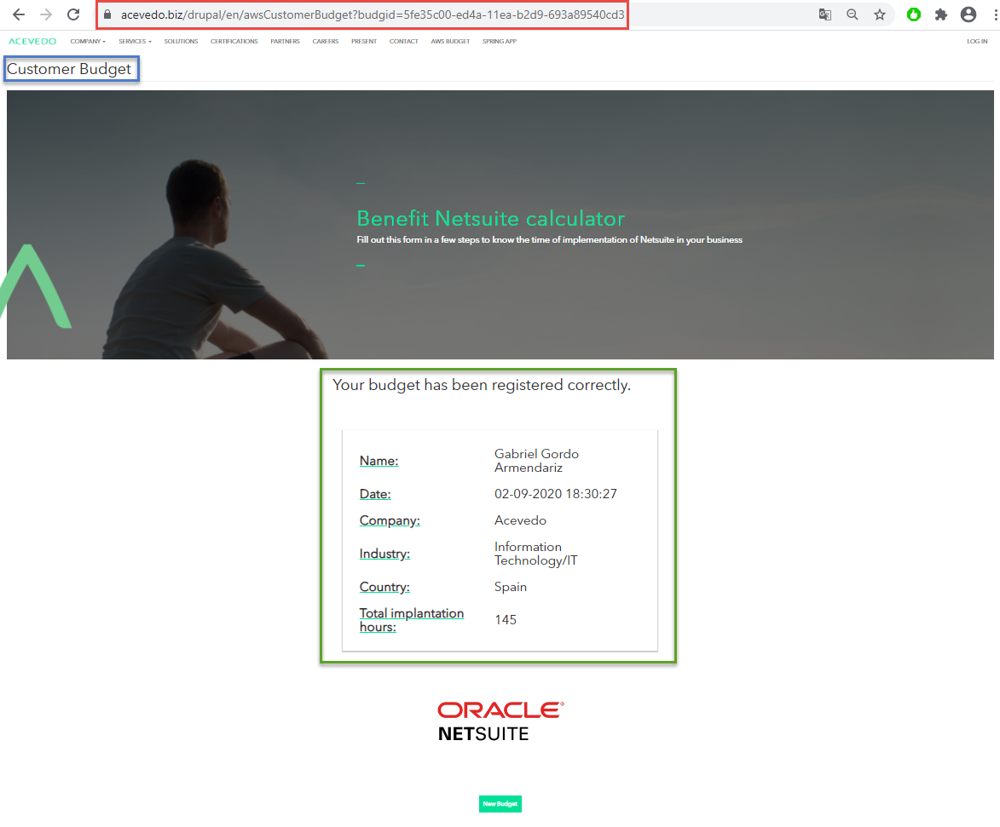

# API WEB - TFM-AWS

### [Go to repository](https://github.com/Gabriel-Acevedo/tfm-aws)

***

## CUSTOMER

_Customer information form._

* ### TEMPLATE: [_customer.html_](https://github.com/Gabriel-Acevedo/tfm-aws/blob/master/src/resources/templates/customer.html)

***	

## SAVE CUSTOMER INFO

_Saves the information of the form and creates a new Customer._
|Method| URL|
|:----:|:--:|
|POST|{AWS_URL}/api/customer|

***

## COMPANY

_Customers Company information form._

* ### TEMPLATE: [_company.html_](https://github.com/Gabriel-Acevedo/tfm-aws/blob/master/src/resources/templates/company.html)

***

## SAVE COMPANY INFO

_Saves the information of the form, creates a new Company and adds the new Company to the Customer._
|Method| URL|
|:----:|:--:|
|POST|{AWS_URL}/api/{customerid}/company |

***

## PRODUCT

_Product selection form._

* ### TEMPLATE: [_product.html_](https://github.com/Gabriel-Acevedo/tfm-aws/blob/master/src/resources/templates/product.html)

***

## GET PRODUCTS

_Returns the actual products available to be selected by the Customer._
|Method| URL|
|:----:|:--:|
|GET|{AWS_URL}/api/products|

***

## SAVE NEW BUDGET

_Creates a new budget with the information of the selected products by the Customer._
|Method| URL|
|:----:|:--:|
|POST|{AWS_URL}/api/{customerid}/budget|

***

## BUDGET

_Summary of the Budget._

* ### TEMPLATE: [_budget.html_](https://github.com/Gabriel-Acevedo/tfm-aws/blob/master/src/resources/templates/budget.html)

***

## GET BUDGET

_Returns the information of the recently created Budget._
|Method| URL|
|:----:|:--:|
|GET|{AWS_URL}/api/budget/{budgetid}|

***

### [Go to repository](https://github.com/Gabriel-Acevedo/tfm-aws)