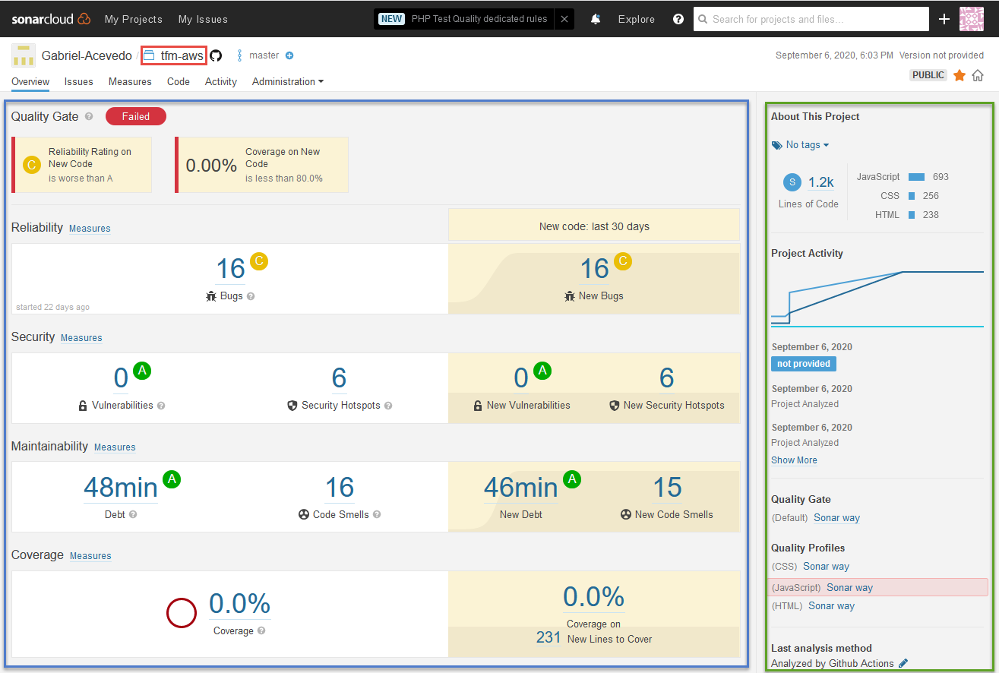
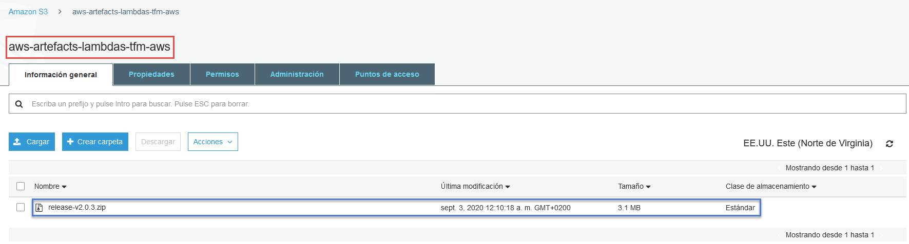

# AWS-Continuous Integration & Continuous Deployment

## CodeBuild & CodePipeline

At first it was proposed for continuous integration to use GitHub Actions. However, after researching the definition and difference between continuous integration and deployment, a more appropriate solution was found allowing to do both. The AWS services that allowed for continuous integration and deployment were CodeBuild and CodePipeline. 

CodePipeline allows the creation of different stages to implement integration and continuous deployment. These stages can be created using different Amazon services, one of them being CodeBuild. 

CodeBuild allows the simulation of a virtual machine with the desired operating system and execute in a series of commands, either to compile, analyze the code or to deploy the application.

Due to the security and service restrictions on AWS, some IAM roles had to be created. These roles can be resumed as the following ones:

* **CodeBuild:**
    - **CodeBuild:** Write
    - **IAM:** Complete Access.
    - **Lambda:** Complete Access.
    - **CloudWatch:** Complete Access.
    - **DynamoDB:** Complete Access.
    - **API Gateway:** Complete Access.
    - **CloudFormation:** Complete Access.
    - **S3:** Complete Access.

* **CodePipeline y CloudFormation:**
    - **CloudFormation:** Complete Access.
    - **CloudWatch:** Complete Access.
    - **CodeBuild:** Read and Write.
    - **CodeCommit:** Read and Write.
    - **CodeDeploy:** Listing and Write.
    - **IAM:** Write.
    - **Lambda:** Listing and Write.
    - **OpsWorks:** Listing and Write.
    - **RDS:** Complete Access.
    - **S3:** Complete Access.
    - **SNS:** Complete Access.
    - **SQS:** Complete Access.

For this application the defined stages where the following:

* **Source:** First stage to be executed and its primary objective is to retrieve the files from GitHub repository and create output artefacts to be used in the next stages.

* **Continuous-Integration:** 

    - **Build-Node:** Compiles the code of the application.

    

    - **Build-SAM:** Builds the CloudFormation template.

    

* **Continuous-Delivery:** Last stage to be executed and its main objective is to deploy the app into production environment.

The configuration for the different actions in CodePipeline where CodeBuild has been used are the following:

* **tfm-aws-MasterCloudapps2020-v1:** Compilation of the code of the node application.

* **tfm-aws-MasterCloudapps2020-SAM-BUILD-v1:** Build of the CloudFormation template.

* **tfm-aws-MasterCloudapps2020-SAM-BUILD-v1:**  Build and deployment of the CloudFormation template.

## Analysis of the Application code

Another continuous integration apart from CodePipeline is the analysis of the repository code. This will be done by Sonar Cloud via GitHub Actions when push or pull request are merged into master branch. Sonar Cloud is a service that allows the analysis of project code located in the GitHub repository, performing a thorough analysis of the application and afterwads showing a detailed report of the bugs and problems found.

Before executing the SonarCloud job, there must exist in the repository a **[sonar-project.properties](https://github.com/Gabriel-Acevedo/tfm-aws/blob/master/sonar-project.properties)** file, which will help SonarCloud to know the repository to be analysed. After this configuration the **[workflow](https://github.com/Gabriel-Acevedo/tfm-aws/blob/master/.github/workflows/sonarcloud.yml)** will execute succesfully and show at the SonarCloud console the result of the analysis.

Example of an excuted analysis of the code:

## Releases

The final continuous integration is a GitHub Actions that will be executed when uploading a tag starting with v or V. This GitHub Actions is composed of a job divided into different stages and will be responsible for backing up the code. The main actions of this **[workflow](https://github.com/Gabriel-Acevedo/tfm-aws/blob/master/.github/workflows/release.yml)** are the creation of a new release, generating a zip file with the application code and uploading this generated zip file to S3 Bucket in AWS, which will be used as an artifact and back up code repository.

Example of saved zip file in S3 Bucket:

